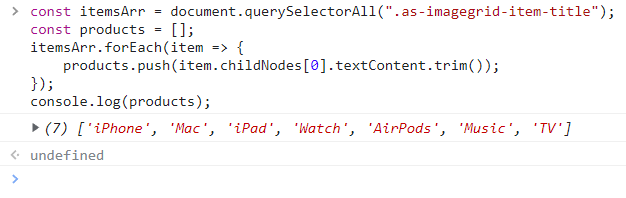
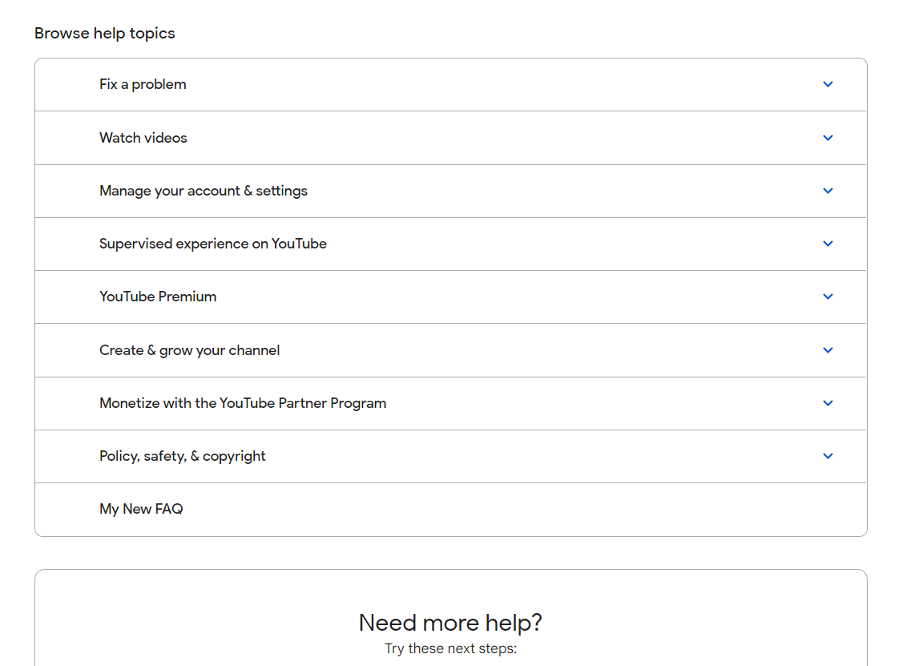
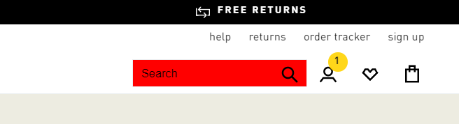
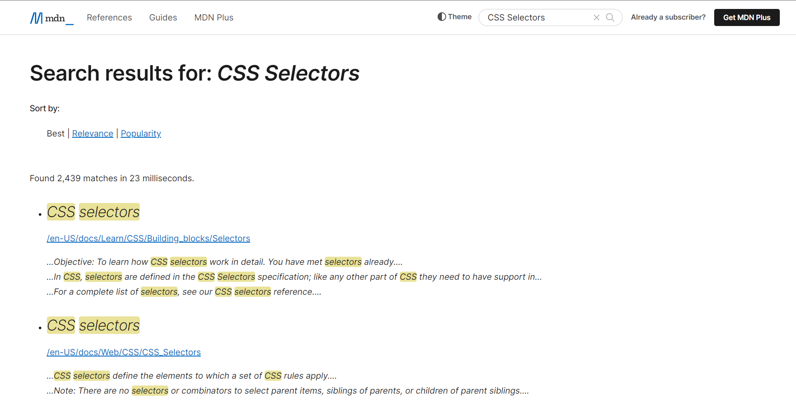
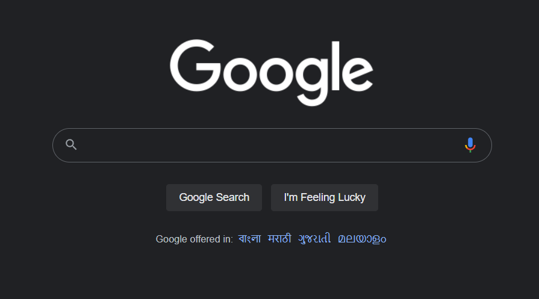
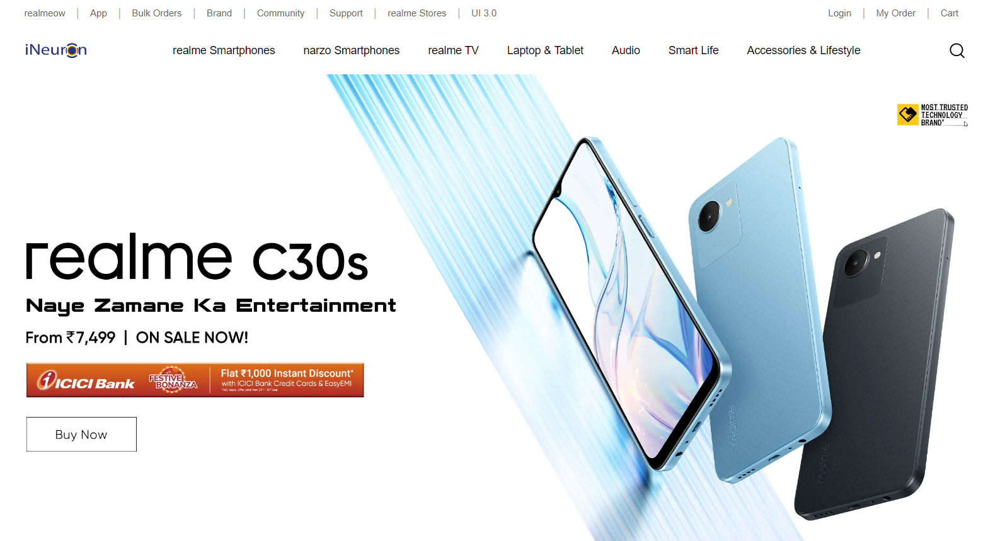
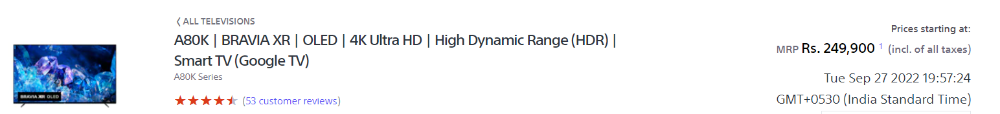

# DOM Manipulation Assignment's Solution

## Task 1

Website Name: [Apple](https://support.apple.com/en-in)

- Fetch all the product name and store in an array

**Solution:**

```
const itemsArr = document.querySelectorAll(".as-imagegrid-item-title");
const products = [];
itemsArr.forEach(item => {
    products.push(item.childNodes[0].textContent.trim());
});
console.log(products);
```

**Output:**


## Task 2

Webiste Name: [Youtube Support](https://support.google.com/youtube/)

- Add another FAQ 'My New FAQ' to the list

**Solution:**

```
const parentNav = document.querySelector("#hcfe-content > section > div > div > article > nav");
const sectionElem = document.createElement('section');
const h3 = document.createElement('h3');
const h3Text = document.createTextNode('My New FAQ');
h3.appendChild(h3Text);
h3.style.padding = '16px 52px 16px 64px';
sectionElem.appendChild(h3);
sectionElem.className = 'parent';
parentNav.appendChild(sectionElem);
```

**Output:**


## Task 3

Webiste Name: [Adidas](https://www.adidas.co.in/)

- Target the search box and on hover change the background color to red.

**Solution:**

```
const searchBox = document.querySelector("#app div.glass-search___X4QNv.glass-search-redesign___2yl_k > div > form > input");
searchBox.addEventListener('mouseover', function() {
    searchBox.style.backgroundColor = 'red';
});
```

**Output:**


## Task 4

Webiste Name: [MDN Web Docs](https://developer.mozilla.org/en-US/)

- To Search a topic in the MDN Search bar.
- First add a text to search in the search bar and then hit the submit search button to search the docs using DOM

**Solution:**

```
document.getElementById("top-nav-search-input").value = 'CSS Selectors';
document.getElementById("top-nav-search-form").submit();
```

**Output:**


## Task 5

Webiste Name: [Google](https://www.google.com/)

- Remove alternate languages from the home page languages listed

**Solution:**

```
const parent = document.querySelector("#SIvCob");
const links = document.querySelectorAll("#SIvCob a");
links.forEach((link, idx) => {
    if(idx % 2 === 0) {
        parent.removeChild(link);
    }
});
```

**Output:**


## Task 6

Webiste Name: [realme](https://www.realme.com/in/)

- Change the realme logo to ineuron logo

**Solution:**

```
document.querySelector(".icon.icon-logo").style.backgroundImage = "url('https://ineuron.ai/images/ineuron-logo.png')";
```

**Output:**


## Task 7

Webiste Name: [Sony](https://www.sony.co.in/)

- Change the button text To current Date.

**Solution:**

```
document.querySelector("#product_summary_default div.btn-container").innerHTML = new Date().toString();
```

**Output:**

